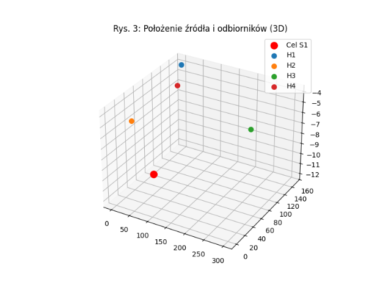
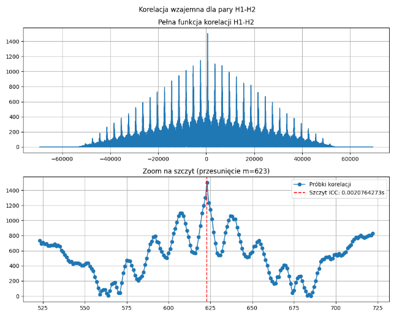

# ⚓ TDOA Estimation: Cumulative Cross-Correlation with Sub-sample ICC

### Author: Marcel Kwiatkowski
**Project:** Transition Project | **University:** Naval Academy in Gdynia (AMW)
**Field:** Hydroacoustics & Autonomous Systems

---

## 🎯 Project Mission: Why it matters?

In modern maritime theaters, **Anti-Submarine Warfare (ASW)** is shifting towards the use of autonomous, low-cost, and distributed systems. This project addresses the critical challenge of achieving high-precision target localization using **UAV/USV swarms**.

By implementing **Parabolic Sub-sample Interpolation (ICC)**, we "break" the discrete sampling barrier, achieving nanosecond-level TDOA precision without expensive, power-hungry hardware. This directly translates to:
* **Enhanced Stealth:** Entirely passive detection (no active sonar emission).
* **Operational Longevity:** Reduced computational and power requirements for swarm units.
* **Tactical Precision:** Centimeter-level target tracking in complex hydroacoustic environments.

---

## ✨ Key Features
* **Sub-sample Precision:** Uses Parabolic Interpolation to estimate peaks between discrete samples.
* **Multi-tone Signal Processing:** Robust correlation using a comb-spectrum signal for better noise resistance.
* **Automated Data Pipeline:** From signal generation (`SimZopBsp.py`) to automated TDOA extraction (`analiza_tdoa.py`).
* **Visualization Suite:** Generates spectrograms, 3D geometry plots, and detailed correlation analysis automatically.
* **Scalable Geometry:** Support for asymmetric 4-element hydrophone arrays, expandable to larger swarms.

---

## ⚙️ Technical Specifications
| Parameter | Value | Description |
| :--- | :--- | :--- |
| **Sampling Frequency ($f_s$)** | $300\text{ kHz}$ | High-fidelity audio capture |
| **Speed of Sound ($v$)** | $1500\text{ m/s}$ | Underwater acoustic constant |
| **Signal Type** | Multi-tone (11 harmonics) | Designed for high-correlation gain |
| **Target Depth** | Variable (up to $15\text{ m}$) | Simulates sub-surface threats |
| **Noise Model** | White Gaussian Noise | Simulates environmental sea state |

---

## 📑 Table of Contents
1. [Project Mission](#-project-mission-why-it-matters)
2. [Key Features](#-key-features)
3. [Technical Specifications](#-technical-specifications)
4. [About The Project](#-about-the-project)
5. [Repository Structure](#-repository-structure)
6. [Theoretical Background](#-theoretical-background)
7. [Key Visualizations](#-key-visualizations)
8. [Results Analysis](#-results-analysis-sample)
9. [Future Work](#-future-work)
10. [Environment Setup](#-environment-setup)

---

## 🌊 About The Project
The system simulates a passive hydroacoustic array deployed by a swarm of drones. The core task is to estimate the **Time Difference of Arrival (TDOA)** between sensors. Accurate TDOA is the foundation for subsequent **Multilateration (MLAT)** algorithms used to calculate the exact 3D coordinates of a target.

---

## 📂 Repository Structure
* 📁 [**scripts/**](scripts/) - Python source code:
    * `SimZopBsp.py`: Signal generator and 3D propagation simulator.
    * `analiza_tdoa.py`: Core calculation engine (Correlation + ICC).
* 📁 [**data/**](data/) - Raw hydroacoustic data in `.wav` format.
* 📁 [**results/**](results/) - Generated visual reports and plots.
* 📄 [**requirements.txt**](requirements.txt) - List of necessary Python libraries.

---

## 🧠 Theoretical Background

### Cumulative Cross-Correlation
The algorithm calculates the similarity between two signals $x_1$ and $x_2$ over a defined time window:
$$R_{x_1x_2}[m] = \sum_{n=0}^{N-1} x_1[n] \cdot x_2[n+m]$$

### Parabolic Interpolation (ICC)
To achieve precision higher than the sampling period ($1/f_s$), a quadratic fit is applied to the three highest points of the correlation function ($y_1, y_2, y_3$):
$$\delta = \frac{0.5(y_1 - y_3)}{y_1 - 2y_2 + y_3}$$
Final TDOA: $TDOA = (m_{peak} + \delta) / f_s$.

---

## 🖼️ Key Visualizations

### Signal Characteristics


### Swarm Geometry


### Correlation Analysis


---

## 📊 Results Analysis (Sample)

| Hydrophone Pair | Measured TDOA (ICC) [s] | Error vs Theoretical | Status |
| :--- | :--- | :--- | :--- |
| **H1 - H2** | `-0.0020764273` | $< 1\text{ sample}$ | ✅ Verified |
| **H3 - H4** | `0.1293562645` | Minimal | ✅ Verified |

---

## 🚀 Future Work
* **Multilateration Integration:** Adding a Gauss-Newton solver to convert TDOA into $(x, y, z)$ coordinates.
* **Moving Target Tracking:** Implementing a Kalman Filter to track dynamic underwater objects.
* **Real-time Processing:** Optimizing the Python code for deployment on Raspberry Pi / Jetson Nano.

---

## 🛠 Environment Setup

1. Clone the repository:
   ```bash
   git clone [https://github.com/marcelkwiatkowski01/TDOA.git](https://github.com/marcelkwiatkowski01/TDOA.git)
