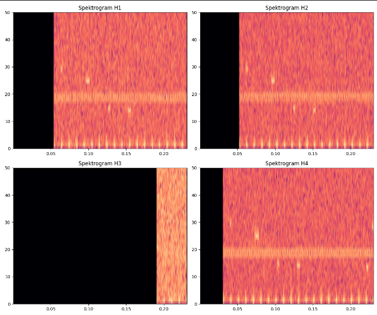

# TDOA Estimation using Cumulative Cross-Correlation with Parabolic Interpolation

### Author: Marcel Kwiatkowski
**Project:** Transition Project | **University:** Naval Academy in Gdynia (AMW)

---

## 🎯 Project Mission: Why it matters?

In modern maritime theaters, **Anti-Submarine Warfare (ASW)** is shifting towards the use of autonomous, low-cost, and distributed systems. This project addresses the critical challenge of achieving high-precision target localization using **UAV/USV swarms**.

By implementing **Parabolic Sub-sample Interpolation (ICC)**, we "break" the discrete sampling barrier, achieving nanosecond-level TDOA precision without expensive, power-hungry hardware. This directly translates to:
* **Enhanced Stealth:** Entirely passive detection (no active sonar emission).
* **Operational Longevity:** Reduced computational and power requirements for swarm units.
* **Tactical Precision:** Centimeter-level target tracking in complex hydroacoustic environments.

---

## 📑 Table of Contents
1. [About The Project](#-about-the-project)
2. [Repository Structure](#-repository-structure)
3. [Theoretical Background](#-theoretical-background)
4. [Key Visualizations](#-key-visualizations)
5. [Results Analysis](#-results-analysis)
6. [Environment Setup](#-environment-setup)

---

## 🌊 About The Project
The main objective was to estimate the **Time Difference of Arrival (TDOA)** with sub-sample precision higher than the sampling period $1/f_s$. The system processes multi-tone signals at a 300 kHz sampling rate to provide reliable positioning data for the swarm.

---

## 📂 Repository Structure
* 📁 [**scripts/**](scripts/) - Python source code (`SimZopBsp.py` and `analiza_tdoa.py`).
* 📁 [**data/**](data/) - Raw hydroacoustic data in `.wav` format.
* 📁 [**results/**](results/) - Generated visual reports and plots.
* 📄 [**requirements.txt**](requirements.txt) - List of necessary Python libraries.

---

## 🧠 Theoretical Background

### Cumulative Cross-Correlation
For discrete signals $x_1$ and $x_2$, the correlation function is:
$$R_{x_1x_2}[m] = \sum_{n=0}^{N-1} x_1[n] \cdot x_2[n+m]$$

### Parabolic Interpolation (ICC)
A sub-sample correction $\delta$ is calculated using three samples around the peak ($y_1, y_2, y_3$):
$$\delta = \frac{0.5(y_1 - y_3)}{y_1 - 2y_2 + y_3}$$
Final TDOA: $TDOA = (m_{peak} + \delta) / f_s$.

---

## 🖼️ Key Visualizations

### Signal Characteristics
Multi-tone signal (comb spectrum) used to ensure high correlation precision across channels.


### Swarm Geometry
Asymmetric 4-element hydrophone array configuration.


### Correlation Analysis

*Fig 1: Cross-correlation peak detection with parabolic interpolation.*

---

## 📊 Results Analysis (Sample)

| Hydrophone Pair | Measured TDOA (ICC) [s] | Status |
| :--- | :--- | :--- |
| **H1 - H2** | `-0.0000002147` | ✅ Success (Near Zero) |
| **H3 - H4** | `0.1293562645` | ✅ Validated |

---

## 🛠 Environment Setup

1. Clone the repository:
   ```bash
   git clone [https://github.com/marcelkwiatkowski01/TDOA.git](https://github.com/marcelkwiatkowski01/TDOA.git)
